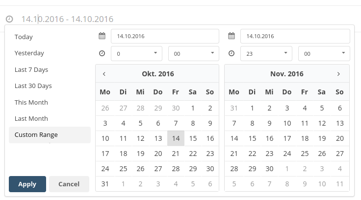

# Date Range Picker for Semantic UI

This is a fork of [dangrossman's daterange picker for Bootstrap](https://github.com/dangrossman/bootstrap-daterangepicker).

It has been optimized to work with Semantic UI.

For an even cooler calendar that also supports daterange inputs see [mdehoog's Semantic UI Calendar](https://github.com/mdehoog/Semantic-UI-Calendar/)
